# 提示词记录 — 2026-03-19

## 会话 1: 有个问题,这个商品主图为啥会变 (00:09~00:15)

1. `00:09` 有个问题,这个商品主图为啥会变

   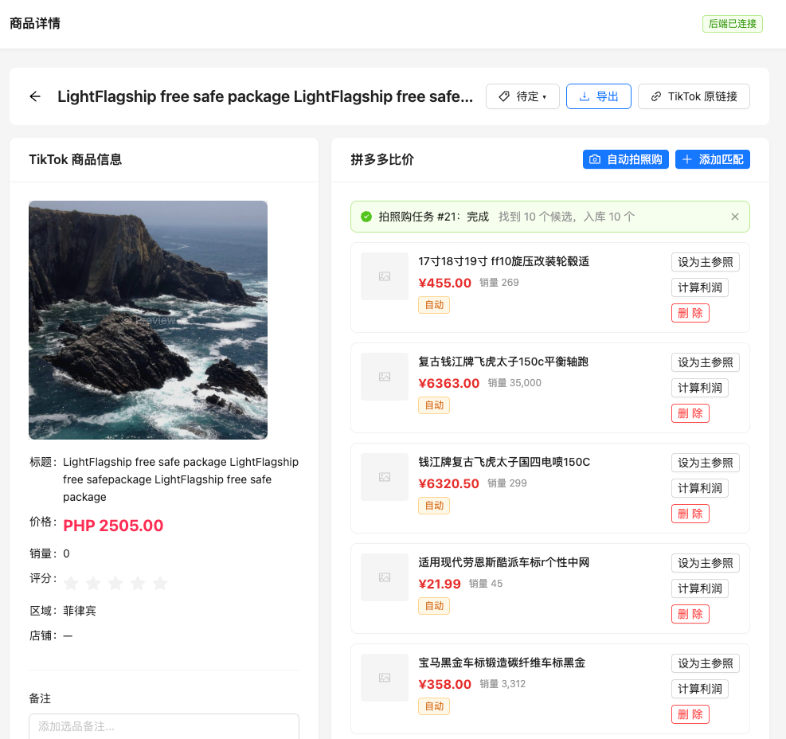

## 会话 2: 启动 (00:20~03:29)

1. `≈00:20` 启动

2. `00:22` 帮我分析点击哪一步会改变这个图片?
定位到代码段

   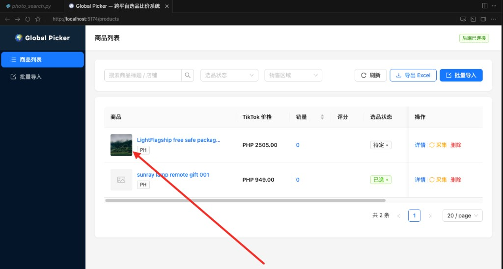

3. `00:50` 1. 自动拍照购 按钮 点击后 不可二次点击 变灰处理,等待采集完成释放
2. 增加后台校验,如果两次连续点击自动拍照购,后台如果正在执行则不处理
3. 校验的时候,如果前端请求关闭, 一段时间后台校验应该释放

   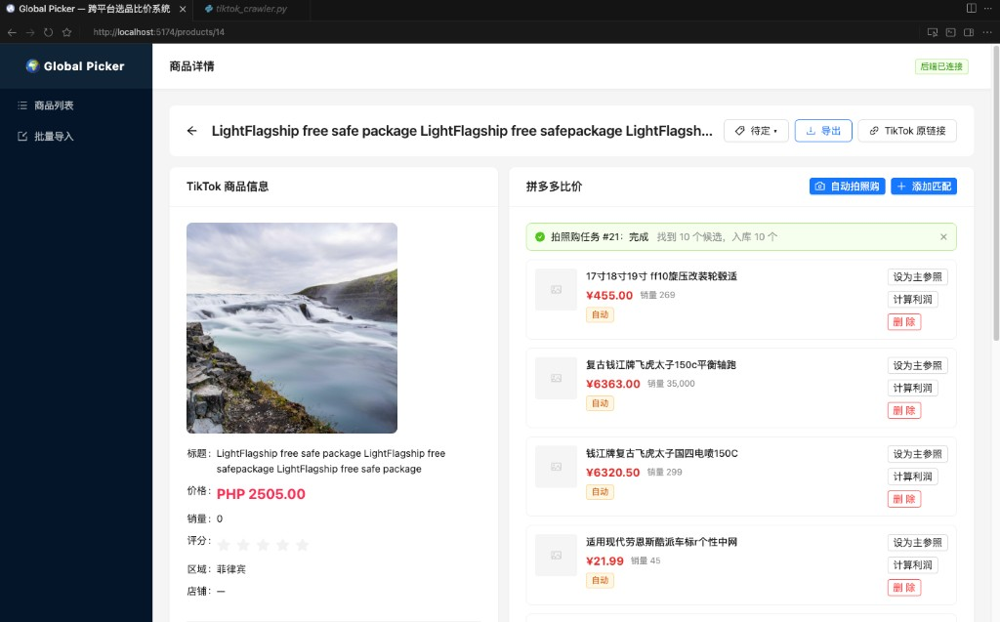

4. `01:08` 自动拍照购拍照后不需要滑动手机直接拍前四个商品就好

   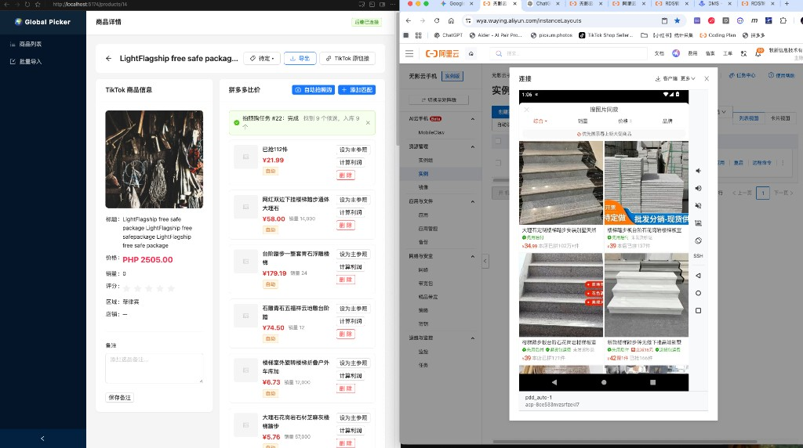

5. `≈01:23` 之前滚动代码也保留只是注释好就好

6. `01:38` 1. 批量导入页面, 采集的时候要求把商品主图抽取出来, 页面css规则截图给你了,如果你需要我可以给你html源代码
2. 要求把商品主图入库到商品表并展示

   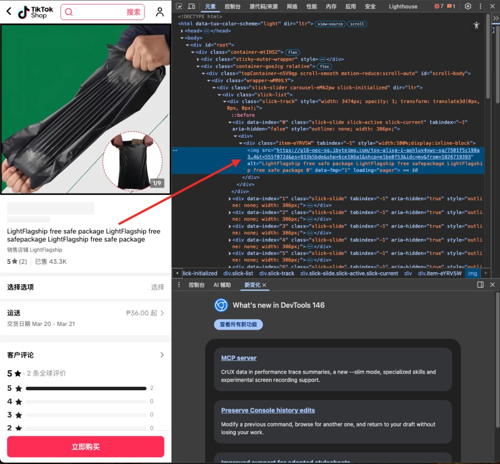
   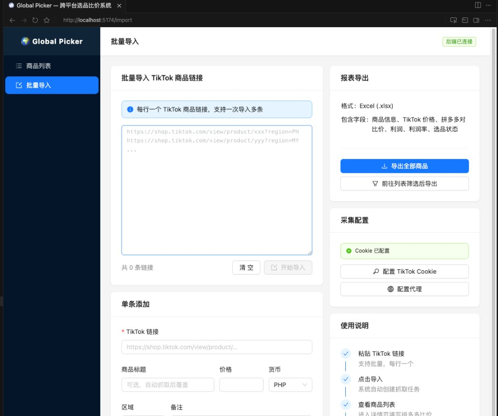

7. `≈02:14` @product_info.json 这是商品信息json在商品页面的html源码里面
采集的实际重要信息从这里面抽取,并丰富商品表,和页面展示,展示主要信息
请完善上面功能,包括数据库

8. `02:50` 其中区域国家从json中抽取

   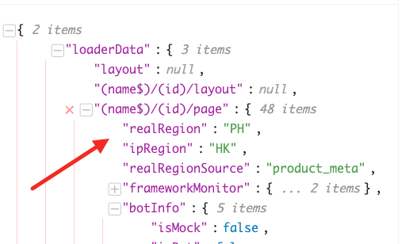

9. `02:54` 入数据库的时候也自动入库这个字段,其中区域如果想存储汉子 用这个字段

   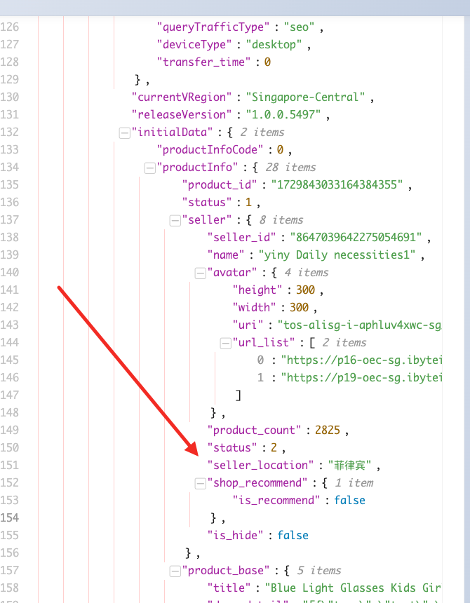

10. `≈03:05` 店铺链接也加上去

11. `03:15` 店铺名称 链接未生效

   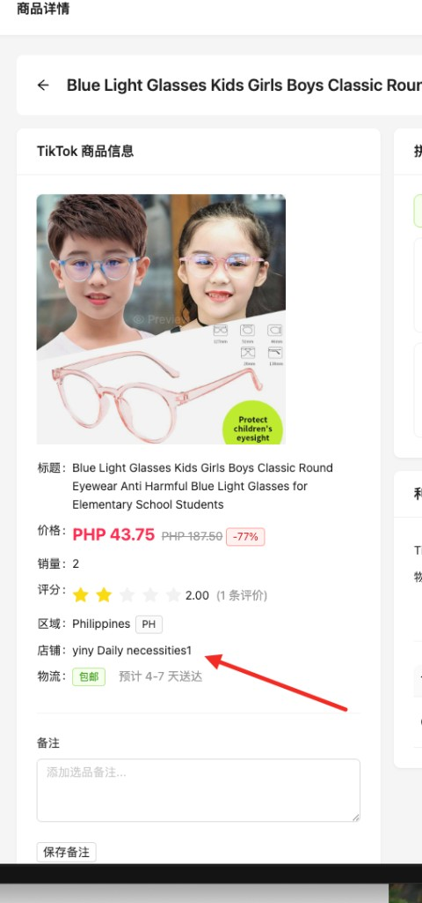

12. `03:20` 这个地方折合成人民币自动换算, 应该有汇率表
同时币种根据采集的国家自动判断正确或者从商品json中自动判断币种

   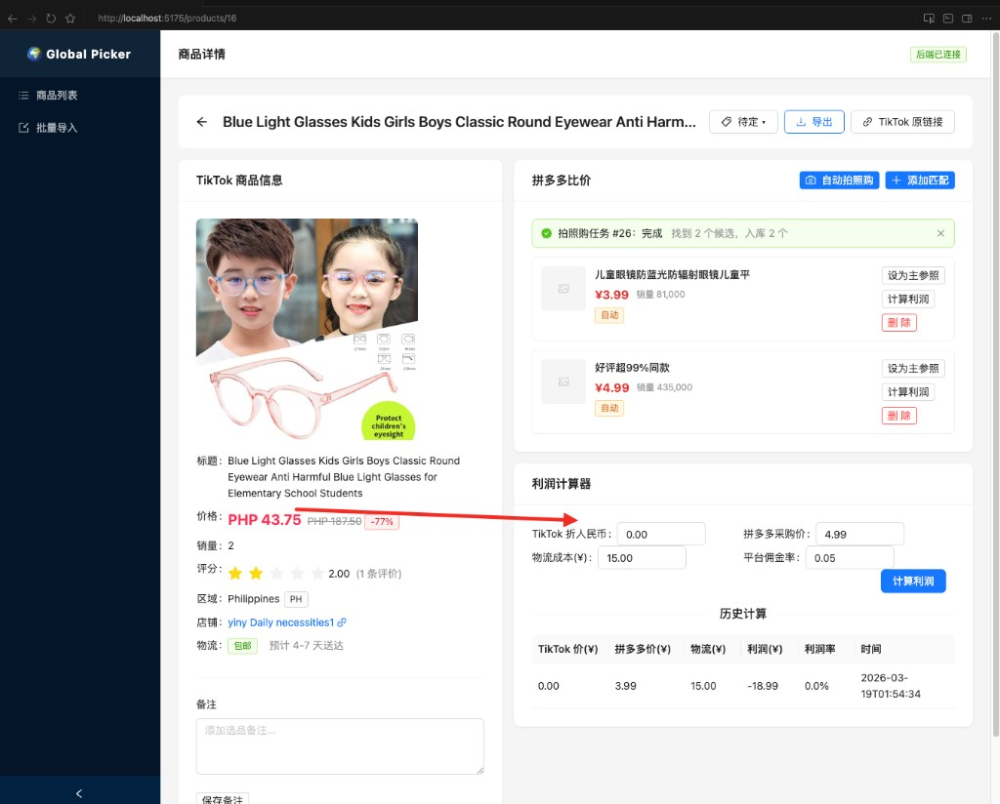

13. `03:29` 多多采购价计算利润的时候持久化存储最后一次计算的之

   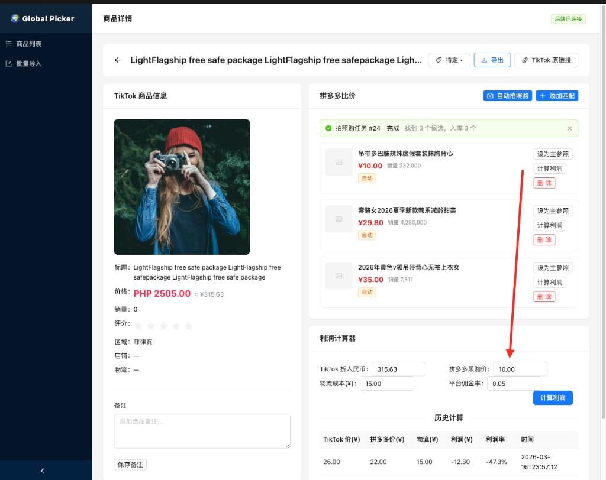

## 会话 3: 打开浏览器 (02:25~02:29)

1. `≈02:25` 打开浏览器

2. `≈02:27` 打开这个网站

3. `≈02:29` 重启启动

## 会话 4: 重启前端 (03:14~03:14)

1. `≈03:14` 重启前端

## 会话 5: 帮我生成一个看板页面统计目前项目的整体需要关注的指标和功能 (03:38~05:50)

1. `≈03:38` 帮我生成一个看板页面统计目前项目的整体需要关注的指标和功能

2. `≈04:39` 数据看板加载报错了

3. `05:40` 

   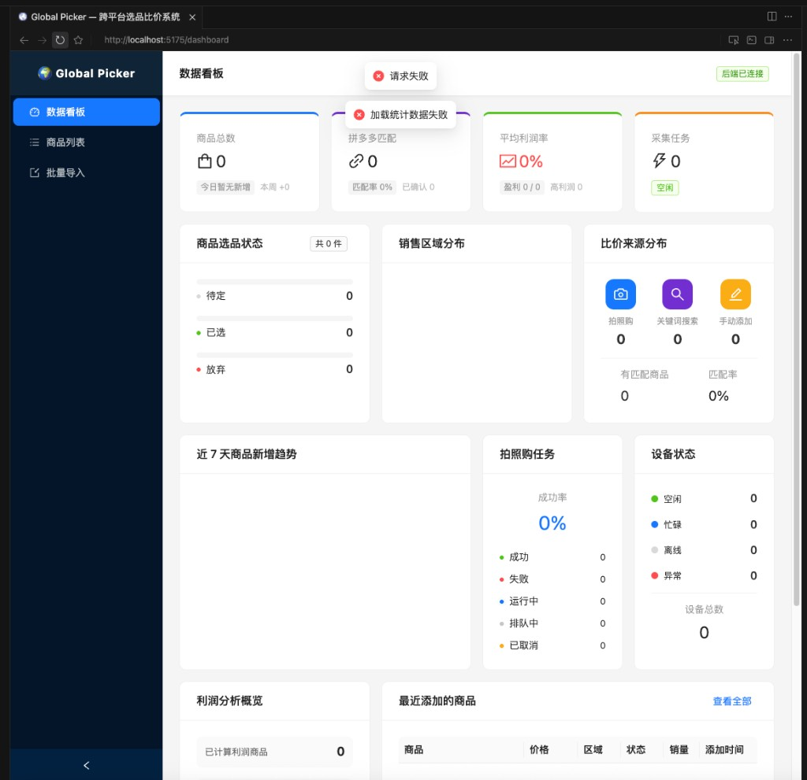

4. `≈05:40` 今日所有修改记录diagnosis

5. `≈05:40` 本项目db_info.txt db_photo_search.sql db_schema.sql .env 
git忽略提交

6. `≈05:40` 敏感信息类似.env 将配置说明写入README.md

7. `≈05:40` sql需要保护吗

8. `≈05:40` 项目功能不太想暴露,如何改

9. `05:40` 

   

10. `≈05:40` 今日所有修改记录diagnosis

11. `≈05:40` 本项目db_info.txt db_photo_search.sql db_schema.sql .env 
git忽略提交

12. `≈05:40` 敏感信息类似.env 将配置说明写入README.md

13. `≈05:40` sql需要保护吗

14. `05:40` 项目功能不太想暴露,如何改

   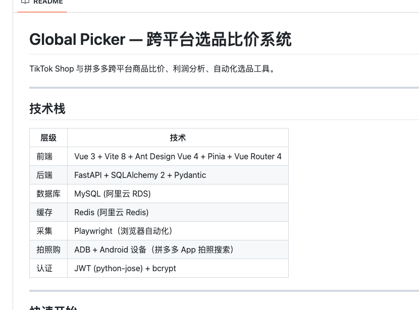
   

15. `≈05:50` 你可以提交git吗?

