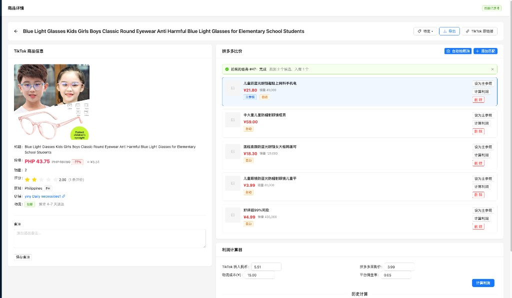
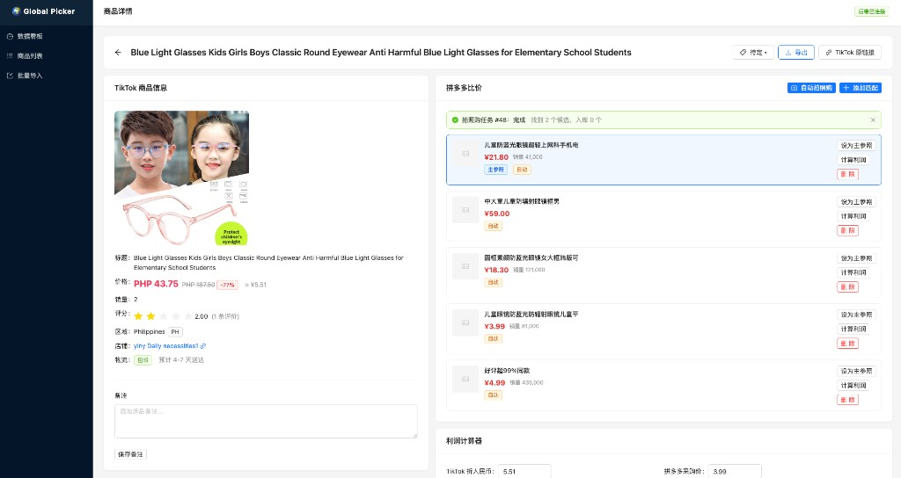
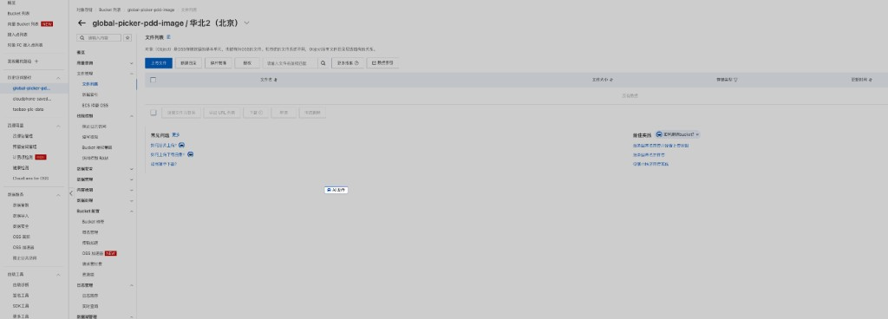
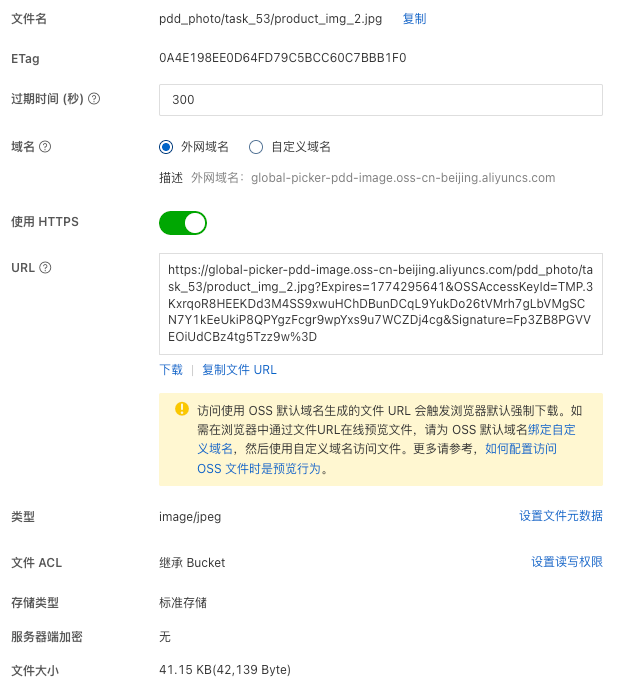
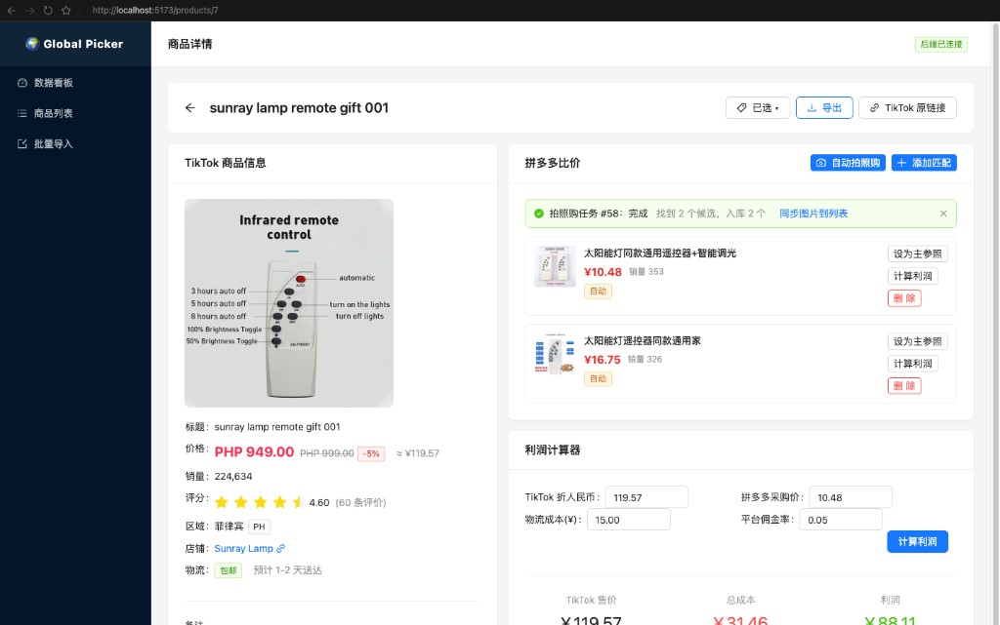
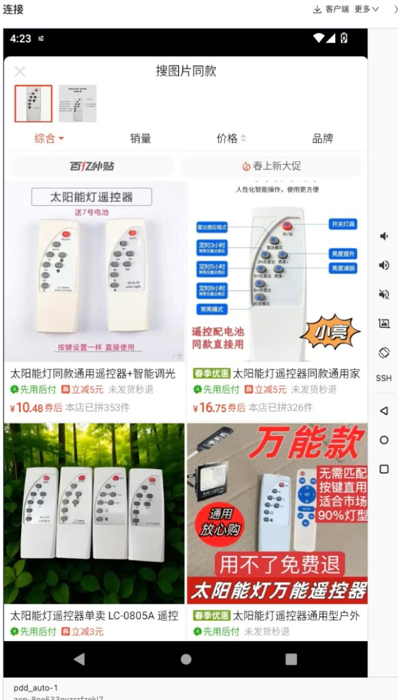

# 提示词记录 — 2026-03-24

## 会话 1: 启动 (02:01~02:02)

1. `≈02:01` 启动

## 会话 2: 通过AI同时将图片返回 (02:11~04:29)

1. `02:26` 通过AI同时将图片返回

   
   

2. `02:41` 图片还是没展示

   

3. `≈03:05` 将pdd图片保存到oss阿里云中
我创建了global-picker-pdd-image
请帮我修改代码,不要再服务器本地存储了, 同时数据库连接也要更改

4. `03:29` 

   

5. `04:01` 文件已经上传请帮我设计,并同步图片链接到数据库存储,并在页面正常显示

   

6. `04:23` 你有办法把pdd商品链接返回吗?

   
   

