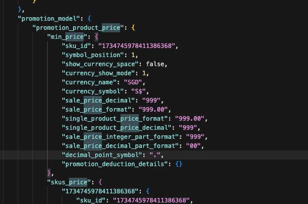
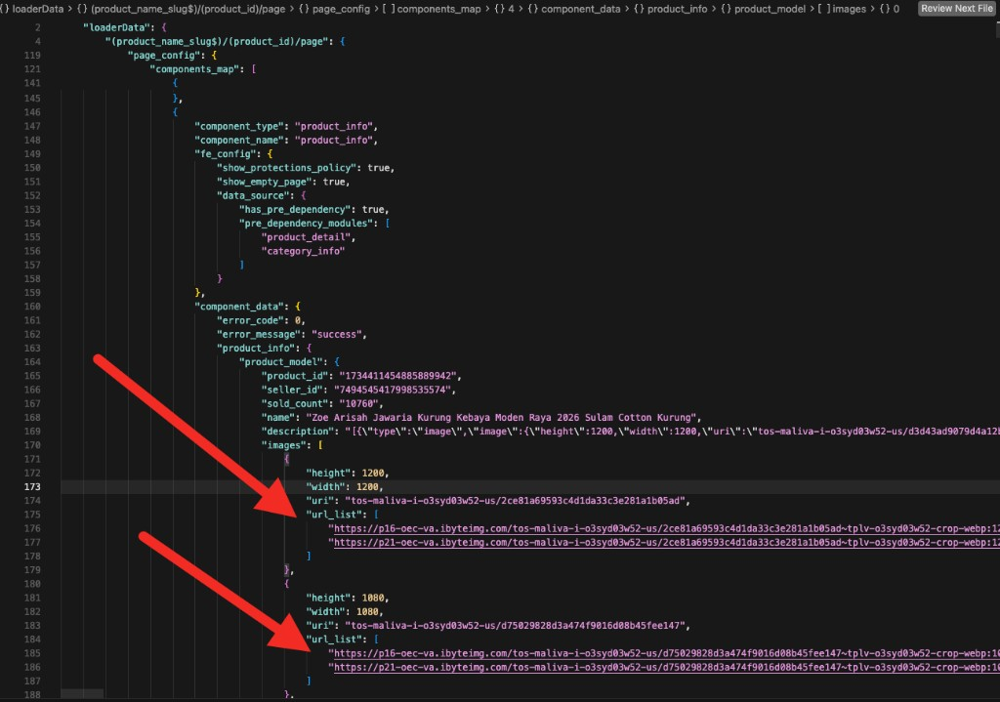
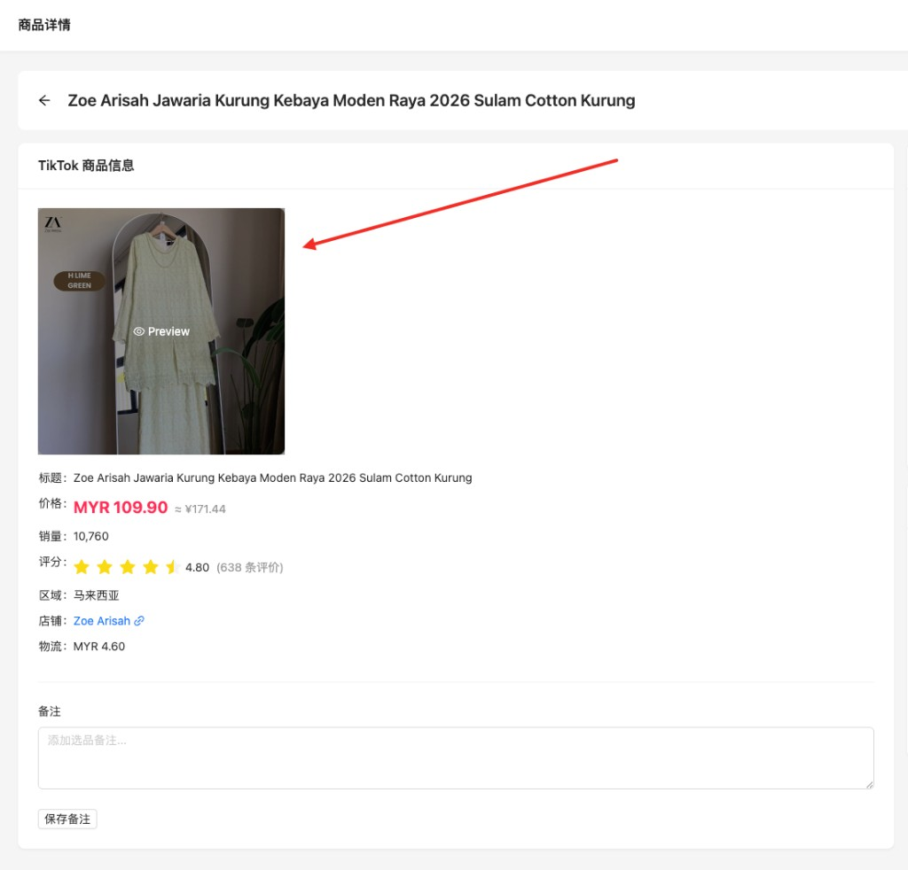
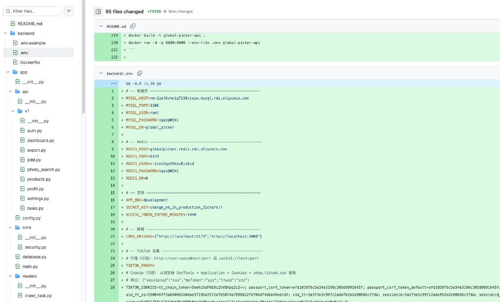
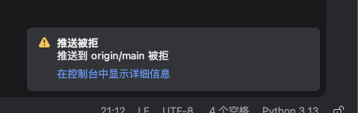
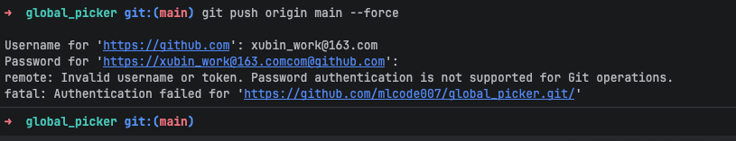
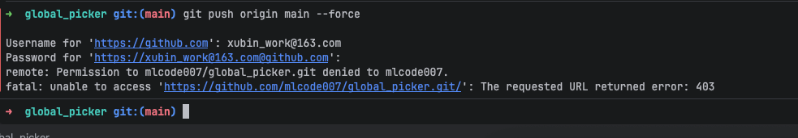

# 提示词记录 — 2026-03-30

## 会话 1: playwright采集价格字段解析错误, 目前抽取方式是什... (04:34~02:38)

1. `01:09` playwright采集价格字段解析错误, 目前抽取方式是什么?
解析应该从源码的json数据格式抽取比较准确

   
   

2. `02:35` 更新商品图片,如果图片有多张需要全部保存, 并同步数据库
页面中展示的时候也需要滚动显示

   
   
   

## 会话 2: @db_info.txt 这个是数据库密码文件,被我提交到了... (03:57~04:03)

1. `≈03:57` @db_info.txt 这个是数据库密码文件,被我提交到了git了 
泄漏了,如何在git删除这个文件并不留任何痕迹

2. `≈04:03` @.env 这个文件也是敏感信息不能提交git,基于现在git状态,请帮我保留这个文件同时加入git过滤,然后不要push到仓库

## 会话 3: @db_info.txt 这个文件git服务器上面已经有记录... (04:24~04:39)

1. `≈04:24` @db_info.txt 这个文件git服务器上面已经有记录了能否删除并同步git服务器清除掉这个文件的历史提交所有记录

2. `04:26` 本地仓库没有问题了但是我的github服务器仓库有记录,我截图给你如何清除
这样别人翻看我的git提交历史也可以找到密码

   

3. `≈04:33` 你帮我弹出浏览器方式认证
这个提交。git push origin --force --all

4. `≈04:39` 我的main分区也有这个问题,该怎么做

## 会话 4: @db_info.txt  @.env 这两个文件都有这个安... (04:41~04:45)

1. `≈04:41` @db_info.txt  @.env 这两个文件都有这个安全问题,请帮我优化

2. `≈04:45` 保留这两个文件不动,从github提交历史里面移除

## 会话 5: @db_info.txt  @.env 这两个文件都有这个安... (04:44~05:24)

1. `≈04:44` @db_info.txt  @.env 这两个文件都有这个安全问题,请帮我优化
保留这两个文件不动, 但是要从github历史提交移除

2. `04:50` 这是main分区是github的默认分区无法删除,虽然本地git历史敏感信息记录都删除
但是我提交github时候被拒绝,怎么解决

   

3. `05:13` 这个地方是提交github的用户名和密码?

   

4. `05:24` 什么意思

   

