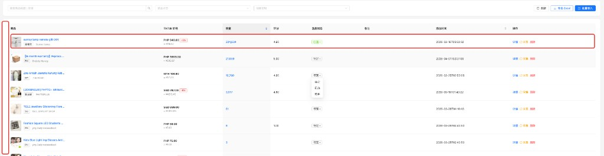
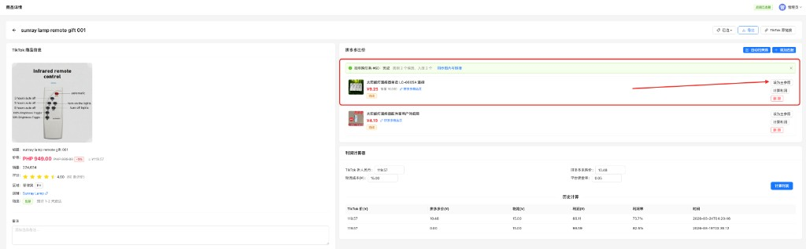
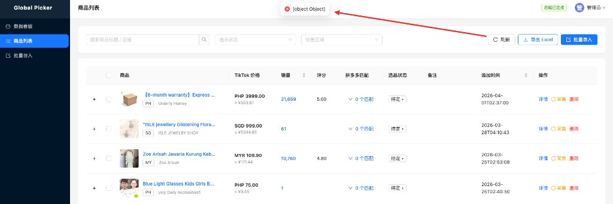
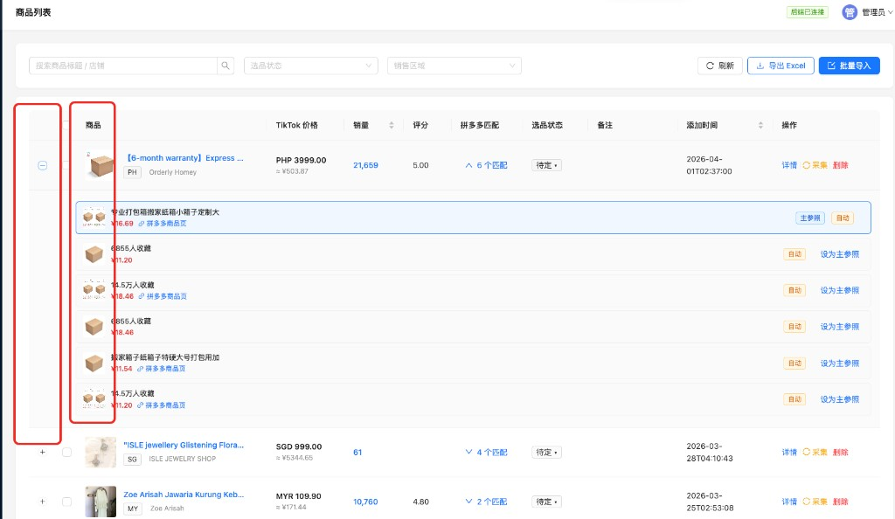

# 提示词记录 — 2026-04-01

## 会话 1: ssh root@47.238.72.198 登录密码:  ... (01:42~02:40)

1. `≈01:42` ssh root@47.238.72.198
登录密码:  A1qaz2wsx3edc123+
这是我的阿里云服务器,服务器登录密码我可以输给你,当前程序github地址:
https://github.com/mlcode007/global_picker.git 

服务器是无帮图的22.4系统,请帮我完成前后台代码上传到服务器

2. `≈01:52` 继续执行

3. `≈02:02` @dev 将刚才部署服务器时候再服务器执行的命令记录到dev文件夹

4. `≈02:11` 把 另外三个文件 放到dev目录

5. `≈02:21` 服务器如何查看日志,我刚才服务器执行了playwright采集报错了

6. `≈02:31` 把修复记录到 @dev/deploy_server.md

7. `≈02:40` 刚又采集一条还是失败了

## 会话 2: 1. 商品详情页面拼多多采集过来的时候默认把第一个商品设置为... (03:11~03:17)

1. `03:12` 1. 商品详情页面拼多多采集过来的时候默认把第一个商品设置为主参照
2. 商品列表需要出现复选框, 实现全选功能
3. 商品列表每个商品下方展示拼多多拍照购采集的商品,并可以折叠隐藏和展示拼多多商品,同时如果设为主参照,需要标记出来

   
   

## 会话 3: 启动服务 (03:11~04:02)

1. `≈03:11` 启动服务

2. `03:30` 刷新的时候报错

   

3. `03:46` 1. 商品列表默认打开, tiktok商品图和拼多多商品图片稍微大一些,做到不放大也能看清楚的目的,整个页面排版尽可能看起来舒适
2. 同时根据tiktok的商品人民币换算价格和主参照的拼多多对表价格计算出商品利润,并展示到列表页面,同时记录数据,这个字段设置主参照的时候计算写入
3. 同时商品列表支持利润范围筛选功能,和tktok价格筛选范围

   

4. `≈04:02` 将改动记录md

