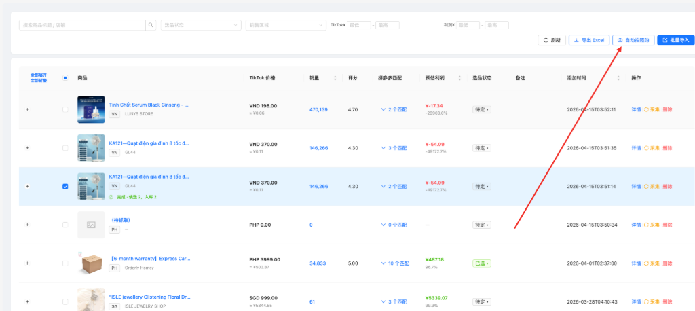
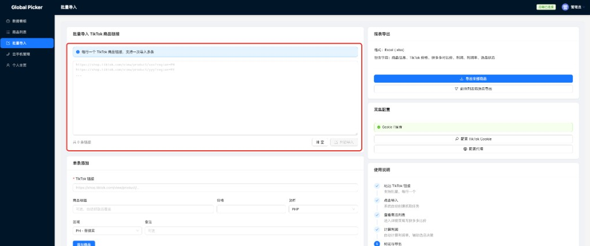
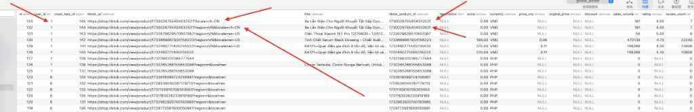

# 提示词记录 — 2026-04-15

## 会话 1: @tiktok_captcha_solver.py 这个脚本... (04:00~04:11)

1. `≈04:00` @tiktok_captcha_solver.py 这个脚本是过tiktok验证码的代码,请在批量导入商品页面,导入商品后开始采集的时候,如果页面出现验证码则通过这个脚本中过验证码的代码过采集时候的验证码

并且过完验证码后,将页面cookie重写入当前用户的Tiktok Cookie配置

并且完成当前页面采集,如果一次验证码没有过则重试三次

2. `≈04:03` 判定页面出现 Verify to continue: 则说明有验证码了

3. `≈04:07` 为啥 没执行滑动啊 浏览器直接关闭了

4. `≈04:11` @tiktok_security_check.txt 这是验证码 时候返回的html,请帮我优化

## 会话 2: @tiktok_captcha_solver.py 这个文件... (04:14~06:20)

1. `≈04:14` @tiktok_captcha_solver.py 这个文件不需要动
采集tiktok商品的时候还是没过验证码, 参考这个文件main中过验证码逻辑,在采集tiktok的完成验证码识别,然后完成采集

2. `≈04:34` 如果, 验证码没过, 重试2次
验证通过后更新tiktokcookie到当前用户表

3. `04:55` 参考自动拍照购功能
将商品采集逻辑实现列表页选中商品的采集
注意: 采集日志记录完善,采集失败异常提示等等
注意两个商品的采集间隔要丝滑,不要卡住

   

4. `≈04:59` 增加一个状态,如果采集正在处理验证码则提示到前段

5. `≈05:03` 撤销上一步操作 ,现在报错了

6. `≈05:08` 先问你下,如果不增加后台代码情况,如果采集过程中出现验证码,我前段如何知道并更新状态

7. `≈05:12` 目前的前段采集状态 有后台操作吗?

8. `≈05:16` 这样还是目前逻辑增加一个状态是不是就可以记录采集正在执行验证码识别动作

9. `≈05:20` 你设计的可以,按照这个方案执行吧, 代码修改要简洁

10. `≈05:25` @add_crawl_task_status_detail_column.py 你执行下这个歉意脚本,并且在这个数据表的sql文件中增加好这个字段

11. `≈05:29` 对用.env的配置

12. `≈05:33` 好执行吧

13. `05:38` https://shop.tiktok.com/view/product/1730028755404032521?locale=zh-CN 
https://shop.tiktok.com/view/product/1730028755404032521?region=VN&locale=zh-CN 
导入商品链接的时候, 应该在用户级别根据商品的产品id去重,而不应该插入新纪录

   
   

14. `≈05:59` 现在服务器上.env文件中缺少

.env 49-51

云手机chinac配置, 请优化 deploy-prod.sh 脚本

但是有要求:

1. 每次执行重新部署脚本拉取服git不会出错

2. 保证可以提交代码到github时候密钥不泄漏

3. 完成服务器脚本自动化脚本部署

15. `≈06:20` 你实现太复杂了,你可以在 @deploy-prod.sh 文件直接将本地.env文件同步到服务器上即可, 这样代码不会泄漏提交因为.gitignore已经忽略

