# 提示词记录 — 2026-04-16

## 会话 1: 重启服务 (01:29~04:34)

1. `≈01:29` 重启服务

2. `01:32` 登录报错

   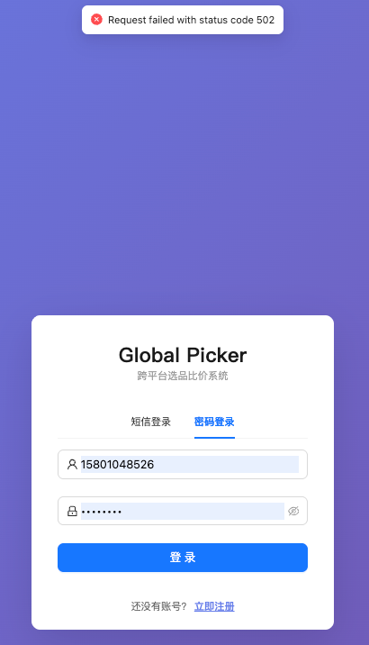

3. `01:55` 选中10/页的时候1000/页 展示不全
选大于50页的时候分页接口报错

   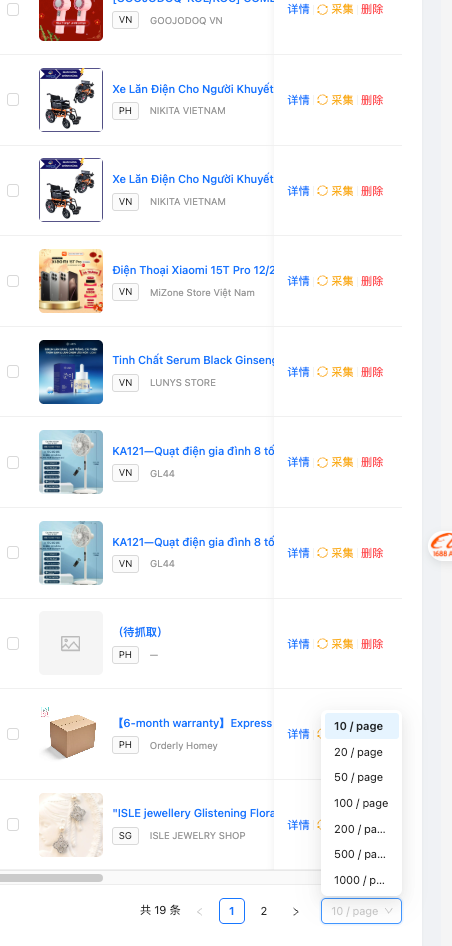

4. `≈02:17` 这个列表选中某个分页比如1000/页的时候 保持这个选择记录

5. `02:39` 自动拍照购逻辑修改
1. 每个商品采集前增加可用设备检查逻辑,保证可用设备可用,逻辑通云手机管理 检查 逻辑
2. 增加采集商品最大数量限制: 默认采集前2个商品
3. 增加是否获取获取拼多多链接逻辑, 如果选否自动化的时候不需要点进商品详情页,优化采集速度
4. 注意选设备的时候多用户应该选自己名下的设备,不要串了

   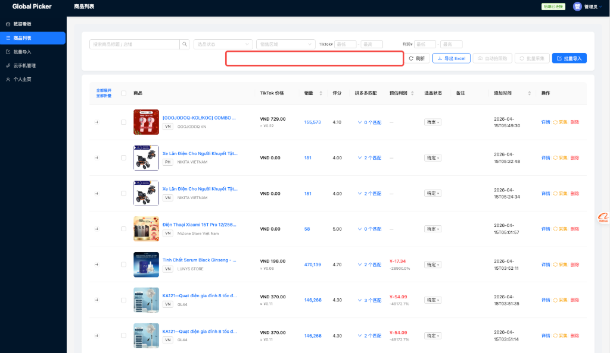
   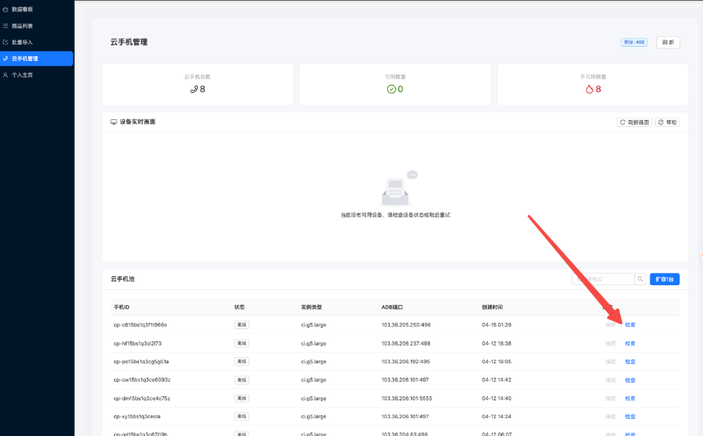

6. `≈02:48` 继续执行

7. `≈02:56` 执行alert脚本,并在建标语句增加字段

8. `≈03:05` 检查adb端口如何adb端口不存在则调用adb启动端口 cloud_phone_create_adb

9. `03:13` 两个问题:
1. 设置采集商品是1,但是采集了两个商品
2. 采集完成后商品没有刷回到列表页并计算利润

   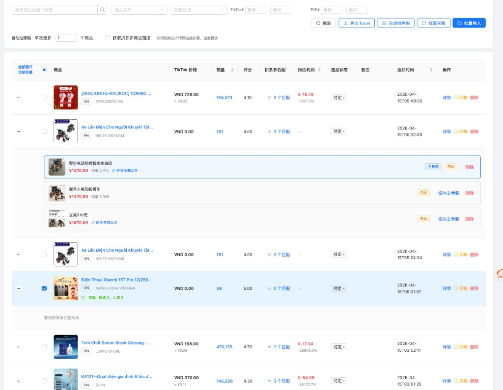

10. `03:16` 设置参数,需要记录网页缓存刷新网页后自动设置成缓存

   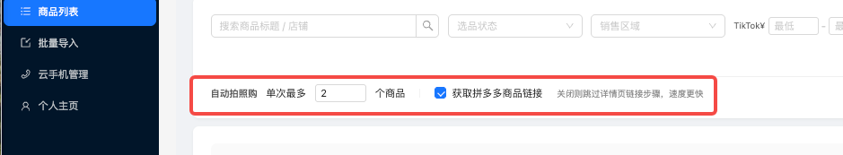

11. `03:20` 汇率算错了吧

   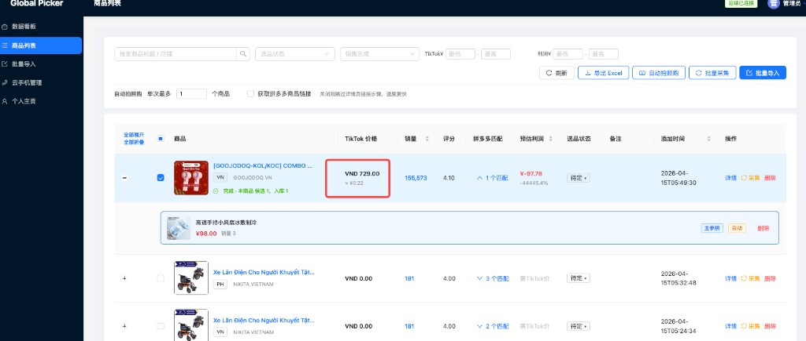

12. `03:31` @tiktok_VN_product.txt playwright采集VN商品的时候注意价格字段抽取
现在采集到结果是0.00

   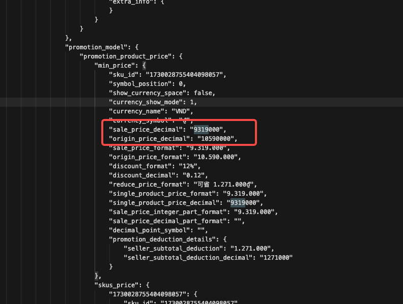
   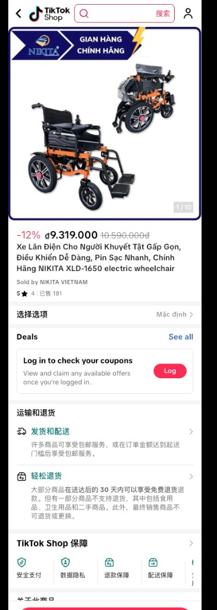

13. `03:31` @tiktok_VN_product.txt playwright采集VN商品的时候注意价格字段抽取
现在采集到结果是0.00

   
   

14. `03:39` 采集的后,如果价格变了,则重新计算利润,并回传当前采集的行

   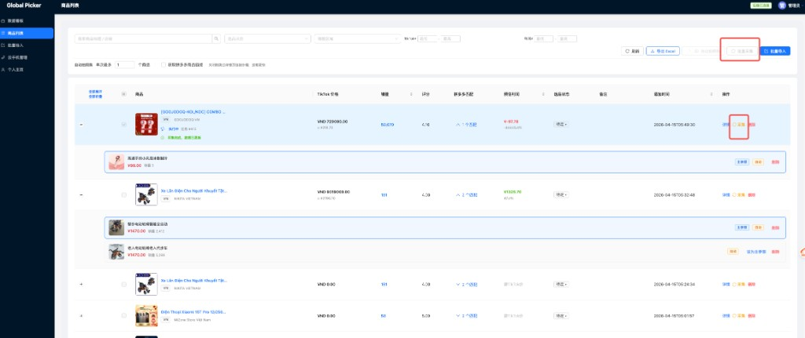

15. `03:45` 设置单词最多采集1个商品
但是拍照购采集回来的是2个商品

   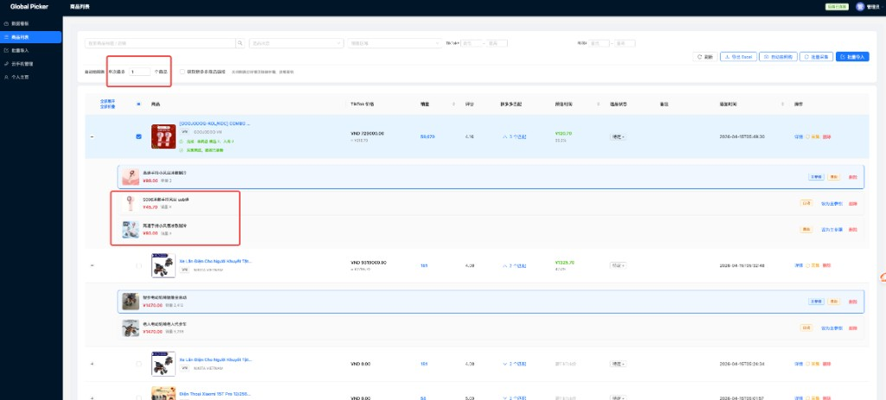

16. `04:00` 这个点击列表页的自动拍照购功能, 应该检查的是 循环逻辑检查该账户下所有非离线设备
执行检查逻辑. 然后再看是否有可用设备, 最好能重试3次,检查的时候也记录到前端页面日志展示

   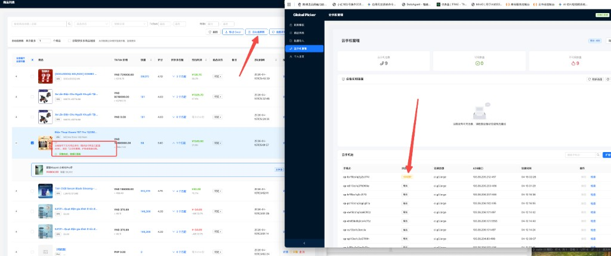

17. `04:07` 日志太丑了, 还用原来的日志展示提示即可

   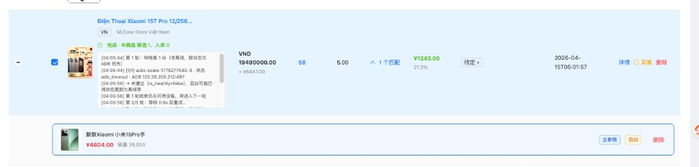

18. `≈04:11` 检查一下每执行自动拍照购 下一个商品的时候是否执行这个设备检查逻辑

19. `04:15` 这样如果pdd采集失败了,或者其他异常导致没有成功, 则改成强制重做一遍设备检查并重新采集这个pdd商品3次,直到成功, 如果3次失败了, 也可以继续执行下一个pdd商品采集,不要中断, 让整个采集流程更流畅

   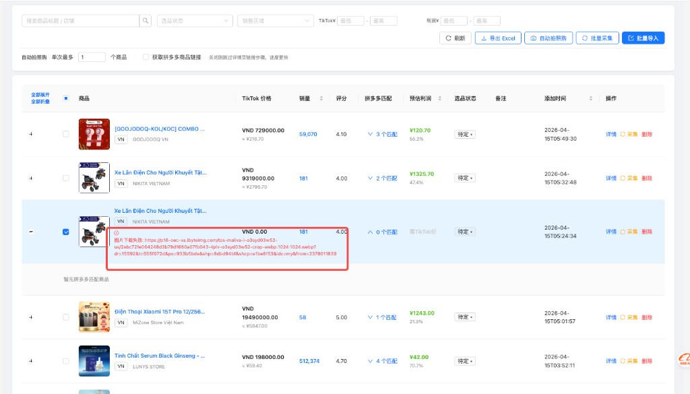

20. `04:23` 采集成功后怎么没有执行第二个商品

   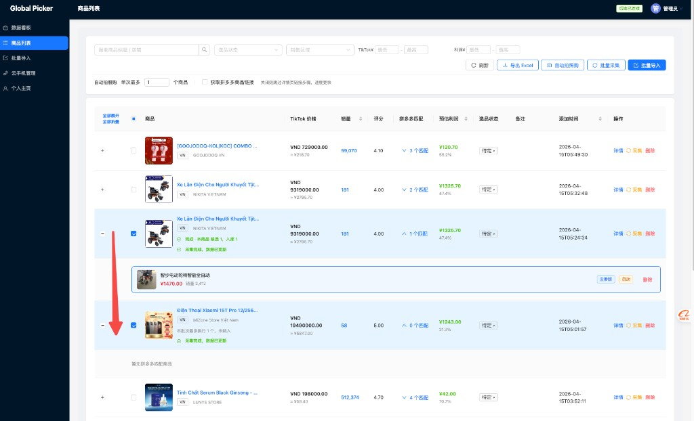

21. `≈04:28` 你理解错了, 自动拍照单词最多1个商品时 云手机采集最后1个商品入库, 不是只处理1个tiktok商品

22. `≈04:34` 把今天修改的记录到docs文件夹下记录成md,文件名记录当天时间

