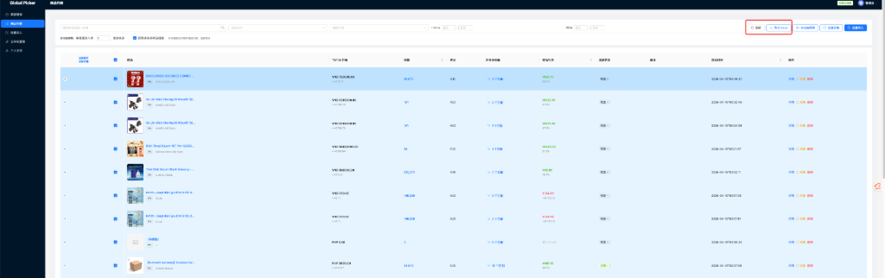
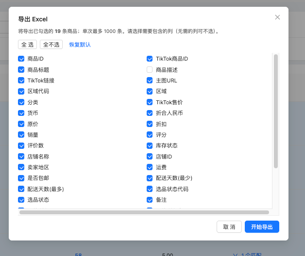
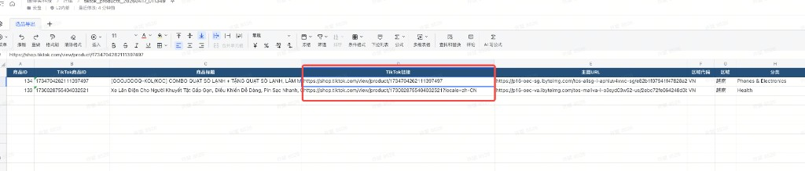
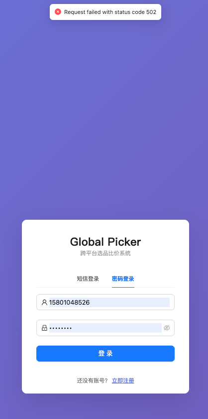
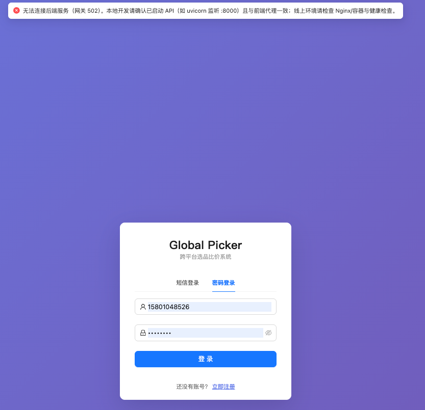
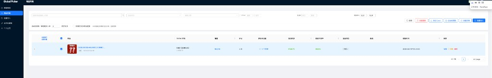

# 提示词记录 — 2026-04-17

## 会话 1: 完整实现 导出Excel功能  1. 未选择商品的时候则灰色... (00:44~04:46)

1. `01:02` 完整实现 导出Excel功能 
1. 未选择商品的时候则灰色,选择商品的时候可以导出已经选择的tiktok商品信息
2. 字段你看着根据核心需求导出完整
3. 点击导出的时候还要保持在本页面不要跳转,体验不好
4. 导出要支持最多1000条商品同时导出
5. 同时需要导出字段设计成页面可选导出,也就是根据需要导出的字段导出,不需要的不需要导出

   

2. `01:19` 1. 提升用户体验: 导出功能,记录浏览器缓存和数据库, 如果浏览器有缓存走浏览器缓存展示需要下载字段,如果用户缓存被删除,则走数据查询需要选中的字段
2. 并不是做多导出1000条而是,根据选中的商品数定
3. 导出商品tiktok链接 如果链接没有locale=zh-CN 则补上

   
   

3. `≈01:28` 继续执行

4. `01:37` 登录报错了

   

5. `01:42` 为啥线上服务器错误

   

6. `≈02:12` @deploy-prod.sh 根据线上部署脚本请检查线上这个问题并修复

7. `≈02:41` 请优化批量删除功能,后台报错了

8. `03:11` 有点问题,不选中商品的批量按钮没了,选中后按钮一行错位了

   

9. `≈03:17` 1

10. `≈03:23` Cursor 配置：
Model Name: qwen-coder-7b-instruct
Base URL: https://dashscope.aliyuncs.com/compatible-mode/v1
key:  sk-ca04dc32406540b58e5fcb5c79741667
怎么配置

11. `≈03:29` 1

12. `≈03:35` 1

13. `≈03:41` 2

14. `≈03:47` 1

15. `≈03:53` 1

16. `≈03:59` 目前你是什么模型

17. `≈04:04` 1

18. `≈04:10` @product_info.json 帮我查一下,当前采集商品有发布时间吗/

19. `≈04:16` 你能识别图片吗?

20. `≈04:22` https://shop.tiktok.com/view/product/1730531415480895463?region=PH&locale=en-US 
这个商品能采集到商品发布时间吗? 你自己访问这个网页并获取内容判断

21. `≈04:28` 还有吗?

22. `≈04:34` 1

23. `≈04:40` 1

24. `≈04:46` 1

## 会话 2: 你什么模型,能给你图片吗? (04:47~05:06)

1. `≈04:47` 你什么模型,能给你图片吗?

2. `≈04:54` 学习下当前项目

3. `≈05:00` 你学习下这个项目代码

4. `≈05:06` 你为啥报错

