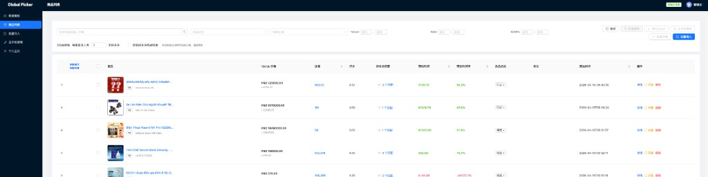
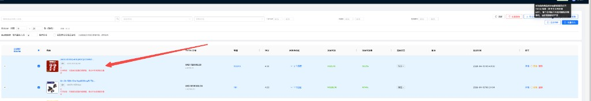
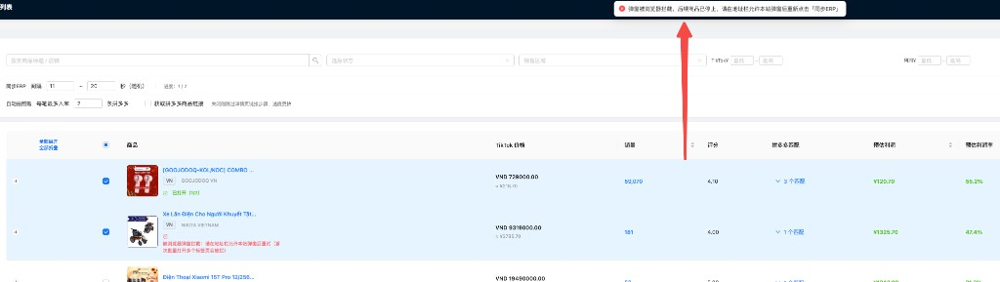
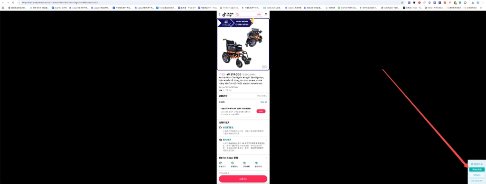
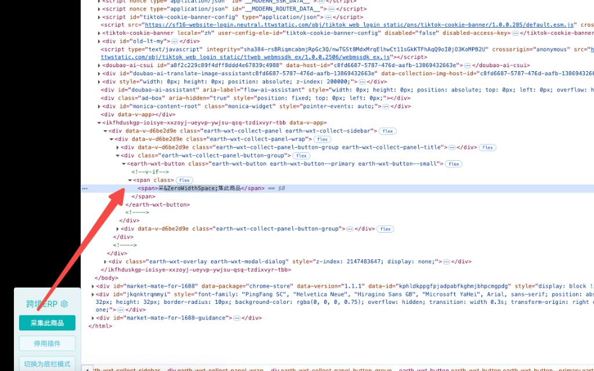
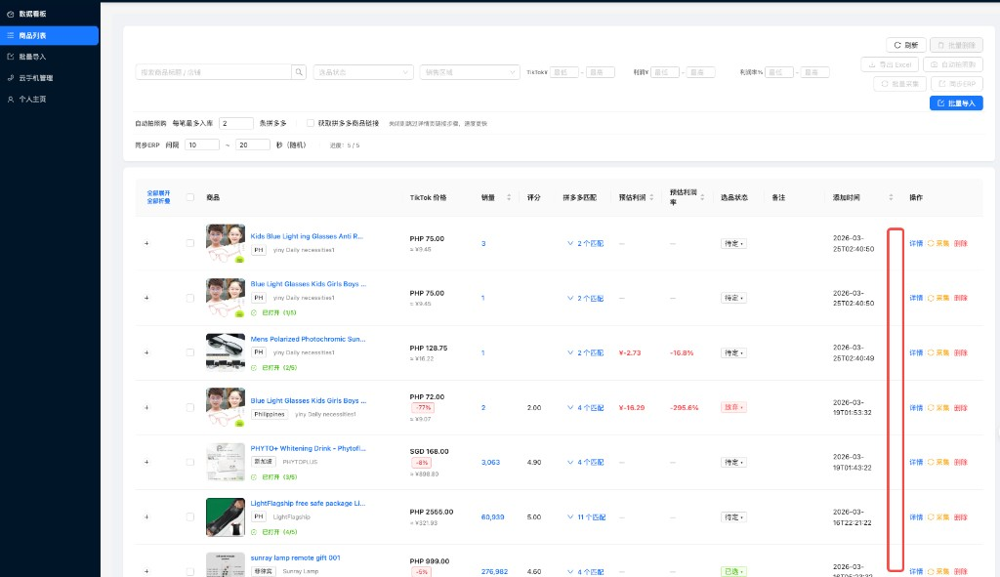
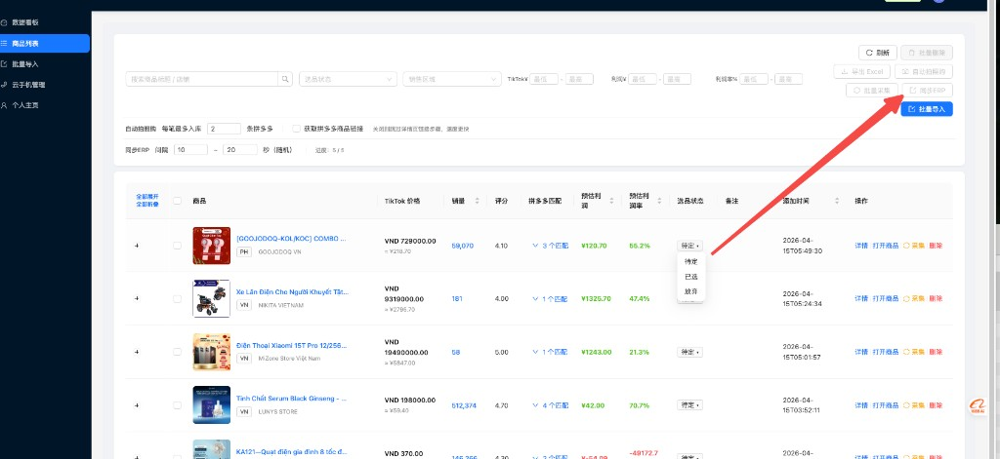

# 提示词记录 — 2026-04-19

## 会话 1: 在商品列表页面, 增加同步ERP功能 1. 根据选中的商品依... (00:36~01:51)

1. `00:36` 在商品列表页面, 增加同步ERP功能
1. 根据选中的商品依次弹框,每次弹框需要间隔一定时间,这个时间可以在页面配置间隔时间区间, 默认 10到20秒随机, 间隔设置记录浏览器缓存设置,下次刷新从缓存读取记录
2. 页面跳转到新浏览器页面的时候,保持目前的浏览器不变, 不要跟着跳转走了,优化体验
3. 当前操作到第几个商品了显示进度,并记录状态到前端

   

2. `00:54` 提示报错了, 但是现在打开后页面跳走了,这个实现不要页面不动吗?

   

3. `≈00:59` 第二个商品没有打开页面
日志没有实现倒计时日志更新

4. `01:04` 什么原因

   

5. `≈01:13` 有没有不需要用户点的方案

6. `≈01:23` 不用open了 用弹框可以吗? 
而且这个弹框打开商品后应该弹出来妙手插件,点击完秒手插件会自动关闭
关闭后再采集其他商品

7. `≈01:32` 在商品列表页面, 增加同步ERP功能

1. 根据选中的商品依次弹框,每次弹框需要间隔一定时间,这个时间可以在页面配置间隔时间区间, 默认 10到20秒随机, 间隔设置记录浏览器缓存设置,下次刷新从缓存读取记录

2. 页面跳转到新浏览器页面的时候,保持目前的浏览器不变, 不要跟着跳转走了,优化体验

3. 当前操作到第几个商品了显示进度,并记录状态到前端

4. 其本质操作是打开新页面会命中浏览器另外一个插件,另外一个插件会检测浏览器中的秒手插件实现自动化点击后关闭当前浏览器,需要我们不断的打开新商品

8. `≈01:42` 如何设置浏览器允许 预开部分标签页

9. `≈01:51` 不要预开所有选中商品,而一个一个打开可以吗?

## 会话 2: 帮我实现一个chrome浏览器插件功能 1. 打开 `htt... (03:07~04:40)

1. `03:14` 帮我实现一个chrome浏览器插件功能
1. 打开 `https://shop.tiktok.com/view/product/` tiktok插件功能的时候, 自动识别网页 采集此商品 按钮并完成点击, 有可能页面刚加载完成不能出现点击,要求定时检测网页状态 是否存在此按钮
2. 点击成功后暂停10秒钟 ,然后关闭本网页
3. 页面元素可能不是button,而是div或者span,用文本扫描方式确定点击位置
比如包含采集两个字的元素然后点击即可
要求,识别网页比较快, 点击按钮比较快, 关闭网页比丝滑
代码要健壮,易读 代码生成到 chrome-extension

   

2. `≈03:17` 页面打开了不要立刻点击按钮等5秒,或者定时检测页面元素 采集此商品 元素

3. `≈03:19` 但是还是没有电

4. `03:21` 不是iframe是这样元素

   

5. `≈03:34` [...document.querySelectorAll('span')].find(s => s.textContent.includes('集此商品'))
太复杂了, 打开页面10秒 点击上面我给你这个元素吧

6. `≈03:46` 没有点击成功的话则不要关闭页面, 每隔10秒刷新页面,直到按钮找到并完成点击

7. `03:59` 在商品列表页增加直接打开商品的操作按钮
如果商品链接没有 locale=zh-CN 参数则加上

   

8. `≈04:06` 现在问你个问题, 打开tt商品的时候有时候出现验证码,自动化过验证码的程序(playwright)已经有了,在目前的代码库
现在要在浏览器插件中过这个验证码,应该怎么设计产品, 是在浏览器插件做(核心代码容易暴露)还是在服务器做(如何交互)
请你帮我设计

9. `04:12` 选品状态增加 已同步ERP 
更新逻辑在 同步ERP采集成功以后即可在服务器端更新

   

10. `≈04:18` @chrome-extension 浏览器插件模块 如果页面时 tiktok验证码页面的话(标题包含是: Security Check),则不要点击按钮, 继续执行其他流程如定时刷新页面等等,直到页面验证码消失

11. `≈04:23` tries 照常累加；达到 MAX_TRIES（120）
120 是不是太长了

12. `04:28` 再兼容一种模式,也不要点击按钮,
就是页面提示 图片这种, 立即登录 情况

   

13. `≈04:34` 逻辑错误应该是, 点击按钮之后 如果出现这个逻辑则也不要关闭当前浏览器,还应该执行 浏览器定期刷新逻辑,因为此时无法同步到ERP

14. `≈04:40` 更新近一周日期的日报

